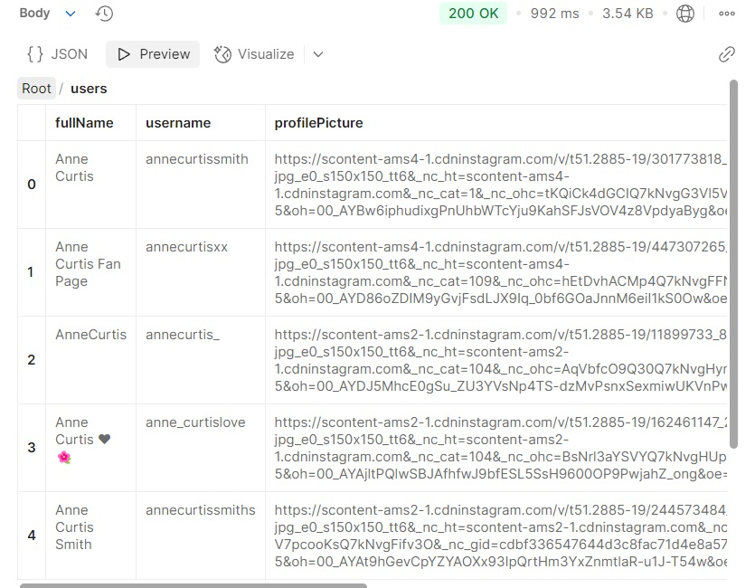
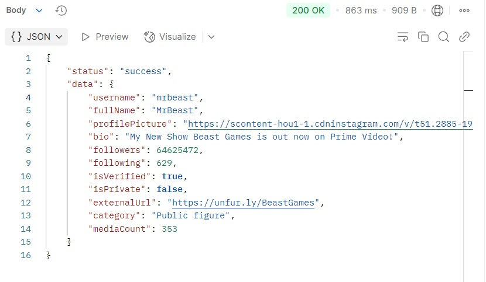

 
# API Documentation

This is the API documentation for the Instagram API service.

## Base URL
`http://localhost:3000/api/instagram`

### External API Host
This API uses the **Instagram Scraper API** hosted on **RapidAPI**:

`instagram-scraper-api2.p.rapidapi.com`

You will need to include the API key and host for accessing RapidAPI services. Here are the headers required for all requests:

X-Rapidapi-Key: 97bfee352bmsh529350ac99792e5p171b11jsnee6aeb5b17f3
X-Rapidapi-Host: instagram-scraper-api2.p.rapidapi.com


## Endpoints

### 1. Search Users

**URL**: `(http://localhost:3000/api/instagram/search-users?query=anne%20curtis)`

**Method**: `GET`

#### Query Parameters:
- `query` (required): The search term for users. (e.g., `anne curtis`)

**Response**:
```json
{
    "status": "success",
    "totalResults": 7,
    "users": [
        {
            "fullName": "Anne Curtis",
            "username": "annecurtissmith",
            "profilePicture": "https://scontent-ams4-1.cdninstagram.com/v/t51.2885-19/301773818_3272505346296207_5274728601697020358_n.jpg?stp=dst-jpg_e0_s150x150_tt6&_nc_ht=scontent-ams4-1.cdninstagram.com&_nc_cat=1&_nc_ohc=tKQiCk4dGCIQ7kNvgG3Vl5V&_nc_gid=cdbf336547644d3c8fac71d4e8a57d71&edm=ANei9xoBAAAA&ccb=7-5&oh=00_AYBw6iphudixgPnUhbWTcYju9KahSFJsVOV4z8VpdyaByg&oe=6787CF4E&_nc_sid=3b96ff",
            "isPrivate": false,
            "isVerified": false
        },
        {
            "fullName": "Anne Curtis Fan Page",
            "username": "annecurtisxx",
            "profilePicture": "https://scontent-ams4-1.cdninstagram.com/v/t51.2885-19/447307265_918292086717957_2550230018080646393_n.jpg?stp=dst-jpg_e0_s150x150_tt6&_nc_ht=scontent-ams4-1.cdninstagram.com&_nc_cat=109&_nc_ohc=hEtDvhACMp4Q7kNvgFFNIse&_nc_gid=cdbf336547644d3c8fac71d4e8a57d71&edm=ANei9xoBAAAA&ccb=7-5&oh=00_AYD86oZDIM9yGvjFsdLJX9Iq_0bf6GOaJnnM6eiI1kS0Ow&oe=6787C3D3&_nc_sid=3b96ff",
            "isPrivate": false,
            "isVerified": false
        },
        {
            "fullName": "AnneCurtis",
            "username": "annecurtis_",
            "profilePicture": "https://scontent-ams2-1.cdninstagram.com/v/t51.2885-19/11899733_892307634191824_1939269372_a.jpg?stp=dst-jpg_e0_s150x150_tt6&_nc_ht=scontent-ams2-1.cdninstagram.com&_nc_cat=104&_nc_ohc=AqVbfcO9Q30Q7kNvgHymPmk&_nc_gid=cdbf336547644d3c8fac71d4e8a57d71&edm=ANei9xoBAAAA&ccb=7-5&oh=00_AYDJ5MhcE0gSu_ZU3YVsNp4TS-dzMvPsnxSexmiwUKVnPw&oe=6787F3EF&_nc_sid=3b96ff",
            "isPrivate": false,
            "isVerified": false
        },
        {
            "fullName": "Anne Curtis ❤️🌺",
            "username": "anne_curtislove",
            "profilePicture": "https://scontent-ams2-1.cdninstagram.com/v/t51.2885-19/162461147_214006687178296_8315115339926347873_n.jpg?stp=dst-jpg_e0_s150x150_tt6&_nc_ht=scontent-ams2-1.cdninstagram.com&_nc_cat=104&_nc_ohc=BsNrl3aYSVYQ7kNvgHUpGSq&_nc_gid=cdbf336547644d3c8fac71d4e8a57d71&edm=ANei9xoBAAAA&ccb=7-5&oh=00_AYAjltPQlwSBJAfhfwJ9bfESL5SsH9600OP9PwjahZ_ong&oe=6787DA98&_nc_sid=3b96ff",
            "isPrivate": false,
            "isVerified": false
        },
        {
            "fullName": "Anne Curtis Smith",
            "username": "annecurtissmiths",
            "profilePicture": "https://scontent-ams2-1.cdninstagram.com/v/t51.2885-19/244573484_3105347543019402_4778853971058044337_n.jpg?stp=dst-jpg_e0_s150x150_tt6&_nc_ht=scontent-ams2-1.cdninstagram.com&_nc_cat=106&_nc_ohc=kv-V7pcooKsQ7kNvgFifv3O&_nc_gid=cdbf336547644d3c8fac71d4e8a57d71&edm=ANei9xoBAAAA&ccb=7-5&oh=00_AYAt9hGevCpYZYAOXx93IpQrtHm3YxZnmtlaR-u1J-T54w&oe=6787F788&_nc_sid=3b96ff",
            "isPrivate": false,
            "isVerified": false
        },
        {
            "fullName": "Anne Curtis Fans",
            "username": "fanneatics_",
            "profilePicture": "https://scontent-ams4-1.cdninstagram.com/v/t51.2885-19/472413110_979320367391933_8528753210866497973_n.jpg?stp=dst-jpg_e0_s150x150_tt6&_nc_ht=scontent-ams4-1.cdninstagram.com&_nc_cat=105&_nc_ohc=Q6GLlckl87AQ7kNvgGVTEDI&_nc_gid=cdbf336547644d3c8fac71d4e8a57d71&edm=ANei9xoBAAAA&ccb=7-5&oh=00_AYBtFy6dMKVm-2BNQn_SUoXxgu7ScQ4n4a4mJt2QBPX58A&oe=6787C395&_nc_sid=3b96ff",
            "isPrivate": false,
            "isVerified": false
        },
        {
            "fullName": "Anne Curtis",
            "username": "annecurtissmith1",
            "profilePicture": "https://scontent-ams4-1.cdninstagram.com/v/t51.2885-19/10785104_594957677297515_1438430376_a.jpg?stp=dst-jpg_e0_s150x150_tt6&_nc_ht=scontent-ams4-1.cdninstagram.com&_nc_cat=107&_nc_ohc=sryj1x4ER74Q7kNvgGvxqPL&_nc_gid=cdbf336547644d3c8fac71d4e8a57d71&edm=ANei9xoBAAAA&ccb=7-5&oh=00_AYBvQs8c89IIJgTzZzmQHKNSHvsaXfnowGcqC47Qaegv9w&oe=6787CAE1&_nc_sid=3b96ff",
            "isPrivate": false,
            "isVerified": false
        }
    ]
}

#resultresponse




## Endpoint: Get User Info

### Method: `GET`
### URL: `/user-info`
This endpoint retrieves information about a specific user by their username.

#### Full Request Example:

http://localhost:3000/api/instagram/user-info?username=mrbeast

#### Query Parameters:
- `username` (required): The Instagram username of the user.

Response Example:

{
    "status": "success",
    "data": {
        "username": "mrbeast",
        "fullName": "MrBeast",
        "profilePicture": "https://scontent-hou1-1.cdninstagram.com/v/t51.2885-19/31077884_211593632905749_1394765701385814016_n.jpg?stp=dst-jpg_e0_s150x150_tt6&_nc_ht=scontent-hou1-1.cdninstagram.com&_nc_cat=1&_nc_ohc=rw56KewJTvQQ7kNvgEfIH5L&_nc_gid=4ec409ade6bd4c5eb6c1744a13dcf3b2&edm=AO4kU9EBAAAA&ccb=7-5&oh=00_AYCindro-nZve4C0d0BGopZ6HvYBtmjlzCip6VH5GcCPPg&oe=6787D38F&_nc_sid=164c1d",
        "bio": "My New Show Beast Games is out now on Prime Video!",
        "followers": 64625472,
        "following": 629,
        "isVerified": true,
        "isPrivate": false,
        "externalUrl": "https://unfur.ly/BeastGames",
        "category": "Public figure",
        "mediaCount": 353
    }
}

